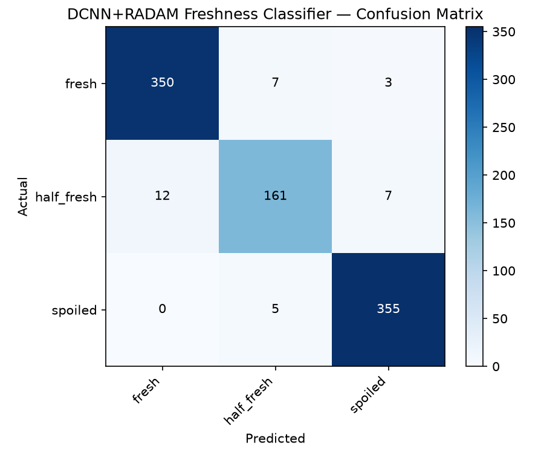

# BeefLink

A computer vision verification layer for organic beef supply listings. BeefLink lets a farmer register a batch with a declared herd count and a photo, independently checks that count with an object detector, independently checks meat freshness from a second photo with an image classifier, and combines both results into a single trust score a buyer can act on — without requiring a prior relationship between farmer and buyer.

Built as an individual prototype for the CE6013 Digital Futures Project (MEng, University of Limerick), sitting inside the wider Mid-West Beef Link concept from the Digital Futures Lab group project.

**Status:** working prototype / research code. Pretrained models are included in `models/`, so you can run the dashboard immediately without training anything yourself.

---

## Contents

- [How it works](#how-it-works)
- [Repository structure](#repository-structure)
- [Requirements](#requirements)
- [Setup](#setup)
- [Running the dashboard](#running-the-dashboard)
- [Training the models yourself](#training-the-models-yourself)
- [Results](#results)
- [Database](#database)
- [Known limitations](#known-limitations)
- [License](#license)

---

## How it works

BeefLink is a four-step pipeline, each step a page in the Streamlit dashboard:

| Step | Page | What happens |
|---|---|---|
| 1 | **Register Supply** | Farmer enters a Farm ID and declared cattle count, uploads a herd photo. No model runs yet — this just records the claim. |
| 2 | **Herd Verification** | A YOLOv8s object detector counts cattle in the herd photo and compares the result to the declared count. |
| 3 | **Meat Verification** | A RADAM feature extractor (frozen ResNet50 + random projections) feeds an SVM classifier that grades a meat photo as `fresh`, `half_fresh`, or `spoiled`. |
| 4 | **Report** | The Verification Engine combines both results into a 0–100 trust score and a final decision (`Verified` / `Review Required` / `Rejected`), and lets a buyer accept or reject the lot. A PDF and a share-text version of the report can both be exported. |

Every batch is tracked by a unique `BATCH-XXXXXXXX` ID through all four steps, backed by a local SQLite database.

**Trust score** (0–100): 40 points for how closely the detected count matches the declared count, 30 points for the detector's average confidence, 30 points for the freshness result (full marks for a confident `fresh`, half credit for `half_fresh`, zero for `spoiled` regardless of confidence). 85+ is `Verified`, 60–84 is `Review Required`, below 60 is `Rejected`. A simpler rule-based decision is computed alongside it for comparison (see `verification/verification_engine.py`).

---

## Repository structure

```
BeefLink/
├── app/
│   ├── dashboard.py              # entry point — run this with `streamlit run`
│   └── pages/
│       ├── 1_Register.py         # Step 1: register a batch
│       ├── 2_Herd_Verification.py    # Step 2: cattle count check
│       ├── 3_Meat_Verification.py    # Step 3: freshness check
│       └── 4_Report.py           # Step 4: trust score + export
├── database/                     # ⚠ see "Setup" — currently named `databases/` in this repo
│   ├── schema.py                 # SQLite schema + helper functions
│   └── sqlite.db                 # created/used at runtime
├── models/                       # pretrained weights (already included)
│   ├── cattle_detector_cbam.pt
│   ├── cattle_detector_yolov8s_baseline.pt
│   ├── freshness_svm_radam.joblib
│   ├── radam_projections.pt
│   └── yolov8-cbam.yaml          # custom YOLOv8s+CBAM architecture definition
├── utils/
│   ├── cbam.py                   # CBAM attention module + Ultralytics registration
│   ├── radam.py                  # RADAM feature extractor
│   └── theme.py                  # shared dashboard styling
├── verification/
│   ├── herd.py                   # herd verification backend
│   ├── meat.py                   # freshness verification backend
│   ├── trust_score.py            # trust score calculation
│   ├── verification_engine.py    # combines both into a final decision
│   └── report_export.py          # PDF + share-text report generation
├── scripts/                      # training, evaluation, and data-prep scripts
├── results/                      # evaluation outputs (metrics, confusion matrix)
├── requirements.txt
└── LICENSE
```

> **Note:** a handful of stray empty files ship in this repo (`app/pages/a`, `databases/m`, `results/b`, `scripts/a`, `utils/h`, `verification/g`) — they look like accidental `touch`/empty commits and are safe to delete; they aren't referenced by anything.

---

## Requirements

- Python 3.9–3.11
- ~1 GB free disk space (pretrained weights + dependencies)
- No GPU required — everything here was built and tested to run on CPU (training is slower without one, but works)

Python dependencies are listed in [`requirements.txt`](requirements.txt):

```
streamlit
pillow
numpy
torch
torchvision
ultralytics
scikit-learn
joblib
reportlab
matplotlib
```

This file didn't exist in the repo yet, so it's included alongside this README — install from it directly (see below). If you know the exact versions you developed against, it's worth pinning them (`pip freeze > requirements.txt`) so the environment is reproducible for anyone else who clones this.

---

## Setup

```bash
git clone https://github.com/Bhagya0529/BeefLink.git
cd BeefLink
```

**⚠️ One fix needed before this runs.** Every page and module imports from `database.schema` (singular), but the folder in this repo is currently named `databases/` (plural). As it stands, running the app will fail with `ModuleNotFoundError: No module named 'database'`. Fix it once with:

```bash
git mv databases database
```

(or rename the folder in GitHub's web UI, then `git pull` locally). Commit that rename and the app will run as documented below.

Then set up your environment:

```bash
python -m venv venv
source venv/bin/activate        # Windows: venv\Scripts\activate

pip install -r requirements.txt
```

---

## Running the dashboard

The pretrained models are already committed to `models/`, so you can launch the full app right away:

```bash
streamlit run app/dashboard.py
```

This opens the dashboard in your browser (default `http://localhost:8501`). Use the sidebar to move between the four pages — Register a batch first to get a Batch ID, then paste that ID into Herd Verification and Meat Verification, and finally view the combined result on the Report page.

Uploaded herd photos are saved to `datasets/uploads/` (created automatically on first use). Verification results are written to `database/sqlite.db`.

If a page tells you a model "hasn't been trained yet," that specific `.pt`/`.joblib` file is missing from `models/` — see the training section below to regenerate it.

---

## Training the models yourself

You don't need to do this to use the app — it's only if you want to retrain on new data or reproduce the results from scratch.

### Cattle detector (YOLOv8-CBAM vs. baseline)

1. Get a cattle/cow detection dataset in YOLO format (this project used the [WRKusuma Cow Detection set](https://universe.roboflow.com/wrkusuma/cow-detection-owqvd) from Roboflow Universe) and place it at `datasets/cattle/`, with a `data.yaml` pointing at the image/label splits.
2. Train the CBAM-augmented model:
   ```bash
   python scripts/train_cattle_detector_cbam.py
   ```
3. Train the plain baseline for comparison:
   ```bash
   python scripts/train_cattle_detector_cbam.py --baseline
   ```
4. Evaluate both side by side:
   ```bash
   python scripts/evaluate_cattle_models.py
   ```

Both scripts save their best weights to `models/cattle_detector_cbam.pt` and `models/cattle_detector_yolov8s_baseline.pt` respectively, overwriting the pretrained ones included in this repo.

### Meat freshness classifier (RADAM + SVM)

1. Get the [Mendeley meat species and hourly freshness dataset](https://data.mendeley.com/datasets/4tj9t3n6vj) and bucket it into `fresh` / `half_fresh` / `spoiled` folders under `datasets/freshness/`:
   ```bash
   python scripts/organize_meat_freshness.py "<path to 'Original Images' folder>" datasets/freshness
   ```
   Add `--beef-only` if you want to exclude the mutton images.
2. Extract RADAM features and train the SVM:
   ```bash
   python scripts/train_freshness_radam.py
   ```
3. Generate a confusion matrix and per-class report:
   ```bash
   python scripts/evaluate_freshness_radam.py
   ```

This produces `models/radam_projections.pt`, `models/freshness_svm_radam.joblib`, and `results/freshness_radam_confusion_matrix.png`.

### Quick single-image sanity check

To test the baseline cattle detector against one photo without going through the dashboard:

```bash
python scripts/test_baseline_on_image.py path/to/photo.jpg
```

### Regenerating the results summary

```bash
python scripts/save_evaluation_summary.py
```

Writes the current metrics into `results/evaluation_summary.md` — edit the numbers in that script if you retrain and get different results.

---

## Results

From the most recent evaluation run (`results/evaluation_summary.md`):

**Cattle detection** — YOLOv8-CBAM vs. plain YOLOv8s baseline, both trained 50 epochs on the same 1,039-image single-class dataset:

| Metric | YOLOv8-CBAM | YOLOv8s Baseline |
|---|---|---|
| mAP50 | 0.864 | 0.869 |
| mAP50-95 | 0.535 | 0.555 |
| Precision | 0.893 | 0.881 |
| Recall | 0.771 | 0.791 |

CBAM didn't beat the plain baseline on this dataset — reported as-is rather than smoothed over. See `results/evaluation_summary.md` for the discussion of why.

**Meat freshness** — RADAM + SVM, 96% overall accuracy on 900 held-out images:

| Class | Precision | Recall | F1 |
|---|---|---|---|
| fresh | 0.97 | 0.97 | 0.97 |
| half_fresh | 0.93 | 0.89 | 0.91 |
| spoiled | 0.97 | 0.99 | 0.98 |



---

## Database

A local SQLite database (`database/sqlite.db`) with four tables: `batches`, `herd_verification`, `meat_verification`, and `reports`, all linked by `batch_id`. Schema and helper functions live in `database/schema.py`; `init_db()` runs automatically on every page load and is safe to call repeatedly. Delete `sqlite.db` at any time to reset all stored batches — it's recreated empty on the next run.

---

## Known limitations

- **Single-user only.** SQLite plus a local Streamlit process means one person can use this at a time — not built for concurrent farmers/buyers yet.
- **No authentication.** Anyone with access to the running app can register batches or record buyer decisions.
- **No confirmed link to AIM.** The herd count is checked for internal consistency (declared vs. detected in one photo), not cross-referenced against Ireland's national Animal Identification and Movement registration records.
- **Trust score weights are hand-set,** not learned from labelled outcome data (there wasn't a labelled ground-truth set available to train against).
- **RADAM has no single-image explainability.** Unlike the earlier MobileNetV3+Grad-CAM version, there's no heatmap showing which part of a photo drove a freshness verdict.

---

## License

Apache License 2.0 — see [`LICENSE`](LICENSE) for the full text.
